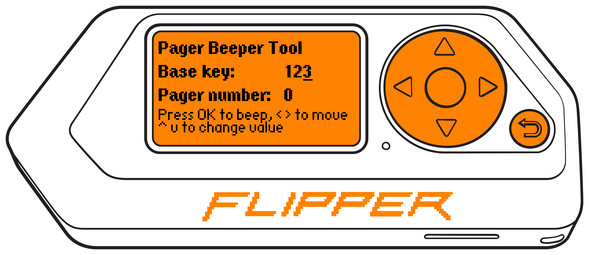

# Pager Beeper Tool

Plugin for Flipper Zero to trigger Retekess T112 restaurant pager systems.

## Supported pagers

### Now

Retekess T112

### TODO

Retekess TD157
Retekess TD158
Kromix W2270

## How to use

1. Install plugin on Flipper
2. Go to Apps -> Tools -> Pager Beeper Tool
3. Enter first 3 bytes of the key
4. Enter pager number to trigger
5. Press OK to trigger it
6. Long press OK to trigger first 20 pagers for this station

## Acknowledgments

https://github.com/meoker/pagger/tree/f238bf340f55a3f817516473f40fc0e2c1daa7ce